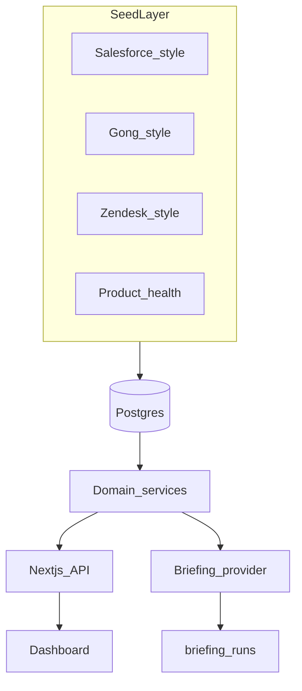

# SignalBrief

**Evidence-backed account intelligence for revenue teams.**

SignalBrief is an internal GTM application prototype that unifies account context from CRM, call, support, and product-health sources into a single dashboard—with deterministic risk signals and structured account briefings backed by evidence.

> Seed scripts simulate upstream source-system ingestion. In production, these would be replaced by idempotent connectors, source metadata, freshness monitoring, backfills, and canonical warehouse models.

## Live demo

**Demo URL:** [https://signalbrief-web.onrender.com](https://signalbrief-web.onrender.com)

Runs **rules-fallback** briefings on Render (no Ollama). Free tier may cold-start after ~15 min idle — open the link before a screen share.

## What it demonstrates

- Unified account view across Salesforce-style, Gong-style, Zendesk-style, and product analytics data
- Canonical `accountId` joins with source provenance (`sourceSystem`, `sourceId`)
- Deterministic risk engine with linked evidence
- Structured briefing generation with Zod validation and audit logs
- Human-in-the-loop feedback—no autonomous write-back to source systems

## Stack

| Layer | Choice |
|---|---|
| App | Next.js, TypeScript, Tailwind CSS |
| Database | PostgreSQL |
| ORM | Drizzle |
| Validation | Zod |
| Tests | Vitest |
| Deploy | Render (web + Postgres) |

## Quick start

**Full guide:** [docs/QUICKSTART.md](docs/QUICKSTART.md)

```bash
git clone https://github.com/DouglasMacKrell/signalbrief.git
cd signalbrief && npm install
cp .env.example .env
docker compose up -d
npm run db:setup
npm run dev
```

Open [http://localhost:3001](http://localhost:3001).

For local Ollama briefings, set `OLLAMA_ENABLED=true` and `BRIEFING_PROVIDER=ollama`. Default model is `qwen3:14b` — see [docs/QUICKSTART.md](docs/QUICKSTART.md).

### Scripts

| Command | Purpose |
|---|---|
| `npm run dev` | Start development server (port 3001) |
| `npm test` | Unit + integration tests |
| `npm run test:all` | Unit + integration + E2E |
| `npm run mcp` | Local read-only MCP server (GTM workflow composability) |
| `npm run security:scan` | Scan staged files for secrets / PII |
| `npm run security:scan:all` | Scan all tracked files |
| `npm run lint` | ESLint |

## Demo accounts

Fictional SMB/Mid-Market HR/payroll customers (seeded data):

| Account | Profile |
|---|---|
| **Acme Creative** | Healthy expansion candidate — rising usage, clean support |
| **Northstar Logistics** | High-risk renewal — stalled pipeline, open tickets, declining usage |
| **Brightline Health Clinic** | Moderate renewal — mixed call themes, open support ticket |
| **Summit Legal Partners** | Enterprise stable renewal — strong health, low friction |
| **Harbor Foods Co-op** | Early-stage discovery — stalled deal, inactive outreach |

See [docs/demo-guide.md](docs/demo-guide.md) for a walkthrough.

## Architecture



Details: [docs/architecture.md](docs/architecture.md)

## Trust boundaries

- **Deterministic risks** are computed in application code—not by the LLM
- **Briefings** must pass schema validation; evidence IDs must exist in account context
- **Production** uses rules-based fallback briefings (no Ollama dependency)
- **No write-back** to Salesforce, Gong, or Zendesk without explicit user approval

Details: [docs/security.md](docs/security.md)

## Production roadmap

1. Idempotent ELT connectors → Snowflake canonical models
2. Read-only MCP tools for internal GTM workflows — [docs/mcp.md](docs/mcp.md) (optional; not the screen-share demo)
3. Optional hosted LLM inference behind authenticated proxy

## Documentation

| Doc | Contents |
|---|---|
| [docs/QUICKSTART.md](docs/QUICKSTART.md) | **Start here** — install, seed, Ollama (`qwen3:14b` default), troubleshooting |
| [docs/architecture.md](docs/architecture.md) | Data model, services, provider pattern |
| [docs/security.md](docs/security.md) | Secrets, Ollama, validation, pre-commit gates |
| [docs/deployment.md](docs/deployment.md) | Render setup, env vars, cold starts |
| [docs/demo-guide.md](docs/demo-guide.md) | Interviewer-friendly product walkthrough |
| [docs/mcp.md](docs/mcp.md) | MCP read-only tools for agents (Cursor) |

## Development practices

- **Branches:** day-to-day work on `develop`; merge to `main` at stable milestones
- **TDD** for domain logic (`src/domain/`) — see `.cursor/rules/tdd-workflow.mdc`
- **Simplicity** over enterprise patterns — see `.cursor/rules/simplicity.mdc`
- **Pre-commit hooks** run secret/PII scan + tests on every commit
- **Commit often**, push with care — see `.cursor/rules/git-push-safety.mdc`

## License

Private portfolio / interview project. All rights reserved unless otherwise noted.
