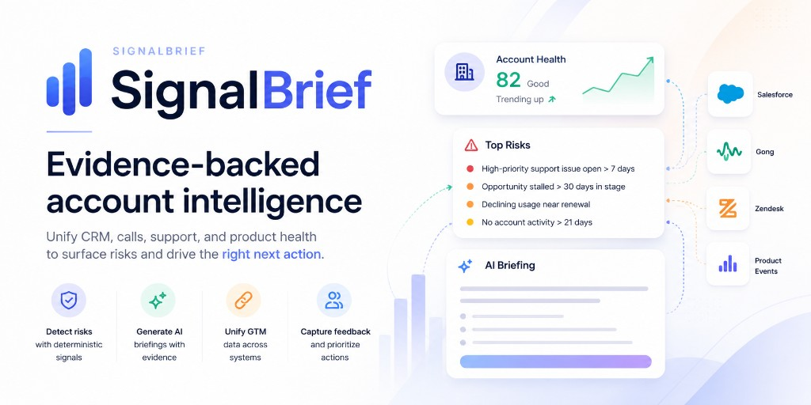
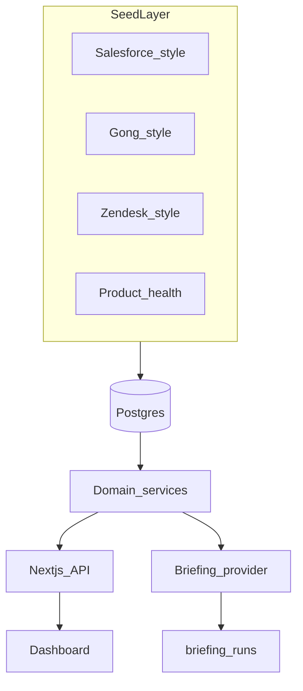

# SignalBrief



*Portfolio showcase by **[Douglas MacKrell](https://www.linkedin.com/in/douglasmackrell)** — exploring how a GTM engineer unifies revenue data, surfaces explainable risk, and ships bounded AI workflows sellers can trust.*

SignalBrief is an internal GTM application prototype that unifies account context from CRM, call, support, and product-health sources into a single dashboard—with deterministic risk signals and structured account briefings backed by evidence.

> Seed scripts simulate upstream source-system ingestion. In production, these would be replaced by idempotent connectors, source metadata, freshness monitoring, backfills, and canonical warehouse models.

## Problem

Revenue teams at high-growth companies do not lack data—they lack **coherent account context** at the moment of action.

| Pain | What actually happens |
|---|---|
| **Fragmented systems** | Reps jump between CRM, call recordings, support tickets, and product usage before every renewal or QBR. Each tool has a slice of truth; none owns the full picture. |
| **Assembly over judgment** | Sellers spend prep time **finding** signals instead of **acting** on them. Renewal risk surfaces late—often as a surprise churn, not an early warning. |
| **Unexplainable “AI”** | Generic LLM wrappers summarize text without **source provenance**. RevOps and sellers cannot trust output they cannot trace, and compliance-minded teams cannot adopt it. |
| **Workflow dead-ends** | Dashboards show data but do not close the loop: no structured next step, no feedback signal, no audit trail when something was generated or approved. |
| **Integration tax** | Every new channel (Slack bot, prep agent, internal tool) re-implements Salesforce/Gong/Zendesk glue unless someone builds a **shared domain layer** first. |

This is the core GTM engineering problem: **turn multi-source customer data into trustworthy, actionable seller workflows**—without giving up governance, evidence, or human approval.

## Solution

SignalBrief is a prototype of how I would approach that role—**internal GTM product**, not a demo chatbot.

### 1. Normalize once, consume everywhere

- Canonical **`accountId`** joins CRM-style opportunities, Gong-style calls, Zendesk-style tickets, and product-health snapshots in Postgres.
- Every record carries **`sourceSystem`**, **`sourceId`**, and **`sourceUpdatedAt`** so claims are traceable and staleness is visible.

### 2. Deterministic signals before generative narrative

- **Risk rules run in application code** (stalled pipeline, open urgent tickets, usage decline near renewal, negative call themes, etc.)—not LLM guesses.
- Each risk cites **evidence** and explains **why the rule fired**, so sellers and RevOps can defend the signal.

### 3. Bounded AI for briefings—not open-ended chat

- Briefings are **structured JSON** (summary, risks, positive signals, next action, talking points) validated with **Zod**.
- Every field that cites data must reference **real evidence IDs** from the account context; invalid output is rejected.
- **Rules-fallback** provider keeps production reliable; **Ollama** (local only) shows how optional inference fits the same contract.

### 4. Trust, audit, and human-in-the-loop

- Every briefing run is logged (`briefing_runs`: provider, latency, status, output).
- **Feedback** (helpful / not helpful) captures quality signals for iteration.
- **Draft follow-up** logs intent via telemetry—**no write-back** to CRM or support systems without explicit user approval.

### 5. Composable for the next workflow

- The same domain services power the **dashboard**, **REST API**, and **read-only MCP tools**—so a prep agent or Slack workflow reads canonical context without duplicating integrations or gaining write access.

### 6. Ship a credible demo without hiding tradeoffs

- Public deploy on Render uses **rules-fallback** (no hosted LLM bill, no tunneling home Ollama).
- Local dev can run **real inference** when you want to show the full AI path—same app, same validation, honest provider labels.

**In one line:** unify GTM data → surface explainable risk → generate evidence-backed briefings → log and learn → expose the same layer to humans and agents, safely.

## Live demo

**Demo URL:** [https://signalbrief-web.onrender.com](https://signalbrief-web.onrender.com)

Runs **rules-fallback** briefings on Render (no Ollama). Free tier may cold-start after ~15 min idle — open the link before a screen share.

## For reviewers (hiring manager / async)

**No screen share?** Start here: **[docs/explorer-guide.md](docs/explorer-guide.md)** — 10-minute self-guided tour of the live app, trust boundaries, and where to read about architecture, security, and MCP.

**Quick path:** Home → **Northstar Logistics** → **Show evidence** → **Generate Briefing** → expand **Past briefing runs**. Add `?debug=1` on any account URL for the telemetry footer.

**Questions or want a walkthrough?** See [Author & outreach](#author--outreach) at the bottom of this README.

## What it demonstrates

- Unified account view across Salesforce-style, Gong-style, Zendesk-style, and product analytics data
- Canonical `accountId` joins with source provenance (`sourceSystem`, `sourceId`)
- Deterministic risk engine with linked evidence
- Structured briefing generation with Zod validation and audit logs
- Human-in-the-loop feedback—no autonomous write-back to source systems

## Tech stack

| Layer | Technology | Role in SignalBrief |
|---|---|---|
| **App framework** | Next.js 16 (App Router) | Server components, API routes, dashboard UI |
| **Language** | TypeScript 5 | End-to-end typing across UI, domain, and API |
| **UI** | React 19, Tailwind CSS 4 | Account dashboard, briefing panel, home previews |
| **Database** | PostgreSQL 16 | Accounts, opportunities, calls, tickets, health, audit tables |
| **ORM / migrations** | Drizzle ORM, drizzle-kit | Schema, queries, SQL migrations |
| **Validation** | Zod 4 | Briefing JSON schema, API request bodies |
| **Dates** | date-fns | Freshness, risk windows, relative timestamps |
| **LLM (local optional)** | Ollama (`qwen3:14b` default) | Server-side structured briefings on `127.0.0.1` only |
| **LLM (production)** | Rules-fallback provider | Deterministic briefings—no hosted inference cost |
| **Agent layer** | MCP SDK (stdio) | Read-only tools over shared domain services |
| **Unit / integration tests** | Vitest 4 | Domain logic, providers, API routes (with real Postgres) |
| **E2E tests** | Playwright | Browser flows against production build |
| **Coverage** | Vitest + v8 | Domain and provider coverage reporting |
| **Lint** | ESLint 9 (eslint-config-next) | Static analysis |
| **Local data** | Docker Compose | Postgres for development and integration tests |
| **CI** | GitHub Actions | Tests on push/PR to `main` and `develop` |
| **Pre-commit** | Husky | Secret/PII scan + test suite on every commit |
| **Deploy** | Render | Web service + managed Postgres (`render.yaml`) |
| **Runtime scripts** | tsx, dotenv | Migrations, seed, MCP server, Ollama health check |

**Intentionally not in scope:** microservices, vector DB, hosted LLM APIs, CRM write-back connectors, or auth (prototype/demo boundaries).

Details: [docs/architecture.md](docs/architecture.md) · [docs/deployment.md](docs/deployment.md)

## Quick start

**Full guide:** [docs/QUICKSTART.md](docs/QUICKSTART.md)

```bash
git clone https://github.com/DouglasMacKrell/signalbrief.git
cd signalbrief && npm install
cp .env.example .env
docker compose up -d
npm run db:setup
npm run dev
```

Open [http://localhost:3001](http://localhost:3001).

For local Ollama briefings, set `OLLAMA_ENABLED=true` and `BRIEFING_PROVIDER=ollama`. Default model is `qwen3:14b` — see [docs/QUICKSTART.md](docs/QUICKSTART.md).

### Scripts

| Command | Purpose |
|---|---|
| `npm run dev` | Start development server (port 3001) |
| `npm test` | Unit + integration tests |
| `npm run test:all` | Unit + integration + E2E |
| `npm run mcp` | Local read-only MCP server (GTM workflow composability) |
| `npm run security:scan` | Scan staged files for secrets / PII |
| `npm run security:scan:all` | Scan all tracked files |
| `npm run lint` | ESLint |

## Demo accounts

Fictional SMB/Mid-Market HR/payroll customers (seeded data):

| Account | Profile |
|---|---|
| **Acme Creative** | Healthy expansion candidate — rising usage, clean support |
| **Northstar Logistics** | High-risk renewal — stalled pipeline, open tickets, declining usage |
| **Brightline Health Clinic** | Moderate renewal — mixed call themes, open support ticket |
| **Summit Legal Partners** | Enterprise stable renewal — strong health, low friction |
| **Harbor Foods Co-op** | Early-stage discovery — stalled deal, inactive outreach |

See [docs/demo-guide.md](docs/demo-guide.md) for a walkthrough.

## Architecture



Details: [docs/architecture.md](docs/architecture.md)

## Trust boundaries

- **Deterministic risks** are computed in application code—not by the LLM
- **Briefings** must pass schema validation; evidence IDs must exist in account context
- **Production** uses rules-based fallback briefings (no Ollama dependency)
- **No write-back** to Salesforce, Gong, or Zendesk without explicit user approval

Details: [docs/security.md](docs/security.md)

## Production roadmap

1. Idempotent ELT connectors → Snowflake canonical models
2. Read-only MCP tools for internal GTM workflows — [docs/mcp.md](docs/mcp.md) (optional; not the screen-share demo)
3. Optional hosted LLM inference behind authenticated proxy

## Documentation

| Doc | Contents |
|---|---|
| [docs/explorer-guide.md](docs/explorer-guide.md) | **For hiring managers** — self-serve live demo tour (no candidate required) |
| [docs/QUICKSTART.md](docs/QUICKSTART.md) | **Start here** — install, seed, Ollama (`qwen3:14b` default), troubleshooting |
| [docs/demo-guide.md](docs/demo-guide.md) | Candidate screen-share walkthrough |
| [docs/architecture.md](docs/architecture.md) | Data model, services, provider pattern |
| [docs/security.md](docs/security.md) | Secrets, Ollama, validation, pre-commit gates |
| [docs/deployment.md](docs/deployment.md) | Render setup, env vars, cold starts |
| [docs/mcp.md](docs/mcp.md) | MCP read-only tools for agents (Cursor) |

## Development practices

- **Branches:** day-to-day work on `develop`; merge to `main` at stable milestones
- **TDD** for domain logic (`src/domain/`) — see `.cursor/rules/tdd-workflow.mdc`
- **Simplicity** over enterprise patterns — see `.cursor/rules/simplicity.mdc`
- **Pre-commit hooks** run secret/PII scan + tests on every commit
- **Commit often**, push with care — see `.cursor/rules/git-push-safety.mdc`

## Author & outreach

**Douglas MacKrell** built SignalBrief as a hands-on portfolio piece for **GTM engineering** and internal revenue-tooling roles—connecting fragmented seller data, deterministic signals, and production-safe AI assist.

### Review pipeline

| Step | Where to go |
|---|---|
| **1. See it work** | [Live demo](https://signalbrief-web.onrender.com) — start on home, open **Northstar Logistics** |
| **2. Self-guided tour** | [docs/explorer-guide.md](docs/explorer-guide.md) — 10 min, no screen share required |
| **3. Understand the why** | Problem & Solution sections above · [demo-guide.md](docs/demo-guide.md) |
| **4. Go deeper technically** | [architecture.md](docs/architecture.md) · [security.md](docs/security.md) · source on GitHub |
| **5. Connect** | Email or LinkedIn below — happy to walk through live or discuss how this maps to your stack |

### Contact

| | |
|---|---|
| **Email** | [d.mackrell@gmail.com](mailto:d.mackrell@gmail.com) |
| **LinkedIn** | [linkedin.com/in/douglasmackrell](https://www.linkedin.com/in/douglasmackrell) |
| **GitHub** | [github.com/DouglasMacKrell](https://github.com/DouglasMacKrell) (repo may be private — request access or use the live URL) |

> **For hiring managers:** If you only have a few minutes, hit the [live demo](https://signalbrief-web.onrender.com/accounts/northstar-logistics?debug=1) → **Show evidence** → **Generate Briefing** → expand **Past briefing runs** and the **Trust & telemetry** footer.

## License

Private portfolio / interview project. All rights reserved unless otherwise noted.
