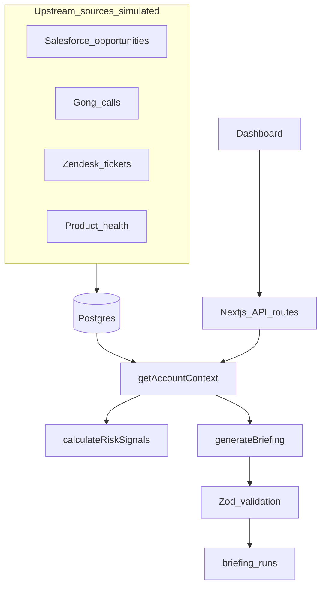
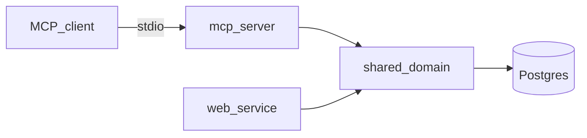

# Architecture

## Overview

SignalBrief normalizes GTM data around a canonical `accountId`. Upstream systems are simulated via seed scripts; each record carries source metadata for evidence provenance.



## Repository layout

```text
app/                    Next.js pages and API routes
src/db/                 Drizzle schema, client, migrations
src/domain/             Business logic (pure where possible)
src/providers/          Briefing provider implementations
src/telemetry/          Structured event logging
src/mcp/                Read-only MCP tools + stdio server
src/seed/               Demo account seed data
scripts/                DB seed, secret scan
tests/                  Vitest domain and API tests
docs/                   Public documentation
```

## Data model

Core tables join on `accountId`:

| Table | Source system role |
|---|---|
| `accounts` | Canonical identity |
| `opportunities` | Salesforce-style pipeline |
| `calls` | Gong-style conversations |
| `support_tickets` | Zendesk-style friction |
| `health_snapshots` | Product analytics |
| `briefing_runs` | Audit log for generated briefings |
| `feedback_events` | User helpful / not-helpful signals |

Every upstream record includes:

```ts
sourceSystem: "salesforce" | "gong" | "zendesk" | "product_analytics";
sourceId: string;
sourceUpdatedAt: Date;
```

## Service layer

| Function | Responsibility |
|---|---|
| `getAccounts()` | List demo accounts |
| `getAccountContext(accountId)` | Unified account payload + freshness |
| `calculateRiskSignals(accountId)` | Deterministic risk cards with evidence |
| `generateBriefing(accountId)` | Provider → validate → persist run |
| `submitFeedback(...)` | Persist user feedback |

UI and API routes call these services—never import seed JSON directly into React components.

## Risk engine

Pure functions in `src/domain/risk-engine.ts`. Example rules:

- No meaningful activity > 21 days
- Opportunity stalled > 30 days in stage
- High/urgent ticket open > 7 days
- Usage decline within 45 days of close/renewal
- Negative call themes in last 30 days
- Health score < 50 at renewal stage

## Briefing provider pattern

```ts
interface BriefingProvider {
  name: "rules-fallback" | "ollama";
  generate(ctx: AccountContext, risks: RiskSignal[]): Promise<Briefing>;
}
```

Production defaults to `rules-fallback`. Local Ollama defaults to `qwen3:14b`. See [QUICKSTART.md](./QUICKSTART.md) for lighter alternatives.

## MCP agent layer (stdio)

Read-only tools for MCP clients, backed by the same domain services as the dashboard. See [mcp.md](./mcp.md).

| Tool | Purpose |
|---|---|
| `list_accounts` | Account picker |
| `get_account_context` | Unified payload |
| `get_risk_signals` | Deterministic risks |
| `get_recent_calls` | Conversation data |
| `get_open_support_tickets` | Support friction |

Briefing generation stays in the app layer (validation + audit), not in MCP.



## Production data path

```text
Salesforce / Gong / Zendesk / Product analytics
        ↓  (idempotent connectors)
Snowflake canonical models
        ↓
Postgres or warehouse-backed API
        ↓
SignalBrief application layer
```

Seed scripts in this prototype stand in for that ELT layer.
